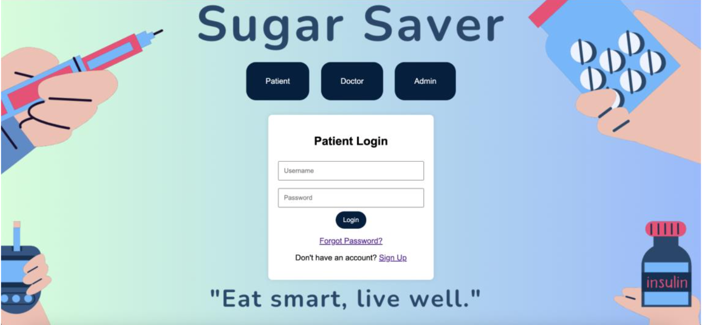
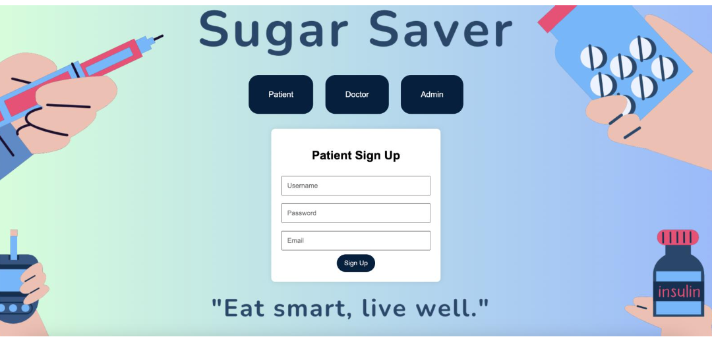

# Sugar Saver: A Comprehensive Diabetes Management Solution  

## 📌 Introduction  
**Sugar Saver** is a diabetes management platform designed to provide an integrated solution for patients, doctors, and administrators. The system enables **secure authentication, patient record management, and personalized diet recommendations** to improve diabetes care.  

## 🎯 Features  
### **1️⃣ User Roles & Access Control**  
- **Admin:** Manages doctor and patient records, including deletion and retrieval.  
- **Doctor:** Views and updates patient records, and recommends personalized diet plans.  
- **Patient:** Uploads and updates medical information, and views personalized diet plans.  

### **2️⃣ User Authentication & Security**  
- Secure login system for **Admin, Doctor, and Patient** roles.  
- Role-based access control ensures privacy and security.  
- Password reset functionality.  

### **3️⃣ Medical Record & Diet Plan Management**  
- Patients can **update** their health records, including HBA1C levels and medications.  
- Doctors can **review patient history** and suggest **customized diet plans**.  

## 🛠️ Tech Stack  
- **Frontend:** HTML, CSS, JavaScript  
- **Backend:** Java (JSP)  
- **Database:** Oracle  
- **Development Environment:** NetBeans  

## 📂 Database Design  
The system consists of **five main tables:**  
1. **Admin** `(AdminId, Name, Email, Username, Password)`  
2. **Patient** `(PatientId, Name, Email, Phone, Gender, Username, Password)`  
3. **Doctor** `(DoctorId, Name, Email, Phone, Gender, Username, Password)`  
4. **Medical Records** `(MRecordId, PatientId, HBA1CLevel, Exercise, Medications, PreferredMeal)`  
5. **Diet Plan** `(DP_id, PatientId, DietPlan, HBA1CLevel)`  

## 🔄 Database Operations  
- **Admin:** View & delete doctor/patient records.  
- **Doctor:** View, update, and recommend diet plans.  
- **Patient:** Upload, update, and access medical records & diet plans.  

## 📸 Screenshots  
- **Login & Signup Pages**
  
   


- **Admin Dashboard**  
- **Doctor Panel (Patient Records & Diet Recommendations)**  
- **Patient Dashboard (Medical History & Diet Plan)**  

## 🚀 Getting Started  
### **1️⃣ Clone the Repository**  
```sh
git clone https://github.com/DhanyaRS0508/Sugar-Saver.git
cd Sugar-Saver
